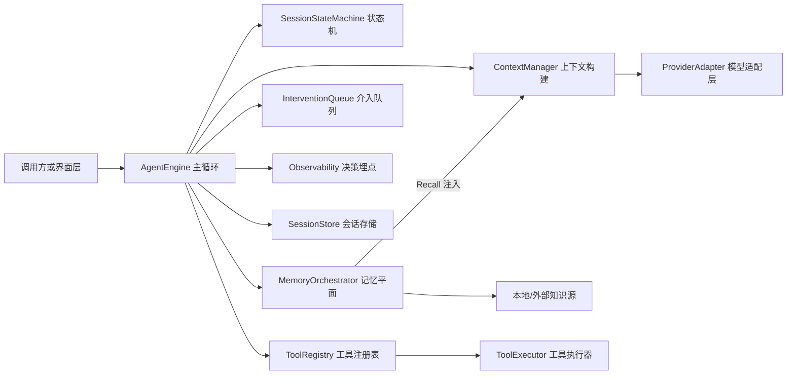
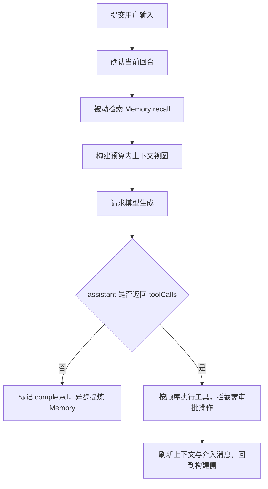
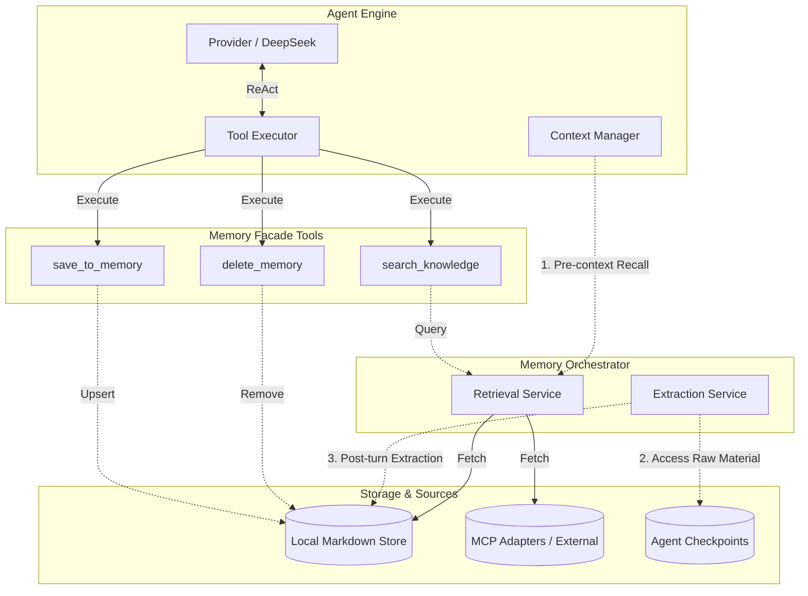
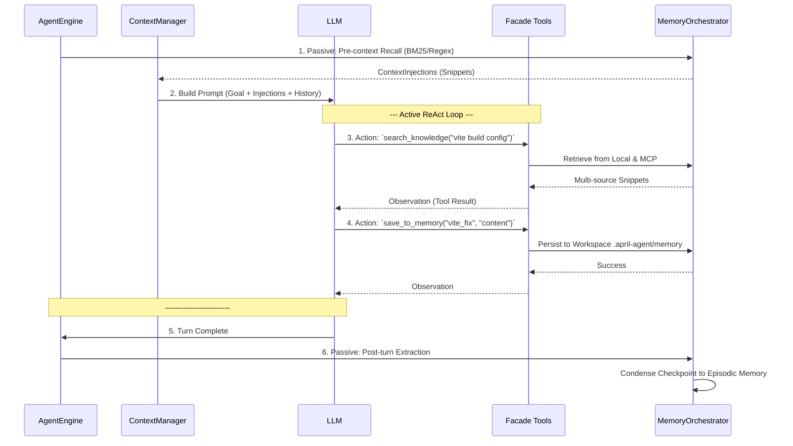

# April Agent Runtime

一个面向 Node 20+ 的通用 TypeScript Agent runtime。它把 ReAct 主循环、LLM 适配层、工具执行、session 持久化、上下文构建与压缩、Memory 记忆管理和决策埋点拆成清晰模块，并把供应商差异限制在 adapter 内。

## 1. 快速开始 (TUI 模式)

### 安装与配置
```bash
npm install
npm run build
cp .env.example .env.local
```

在 `.env.local` 中配置模型密钥（目前内置提供 DeepSeek 适配器）：
```bash
DEEPSEEK_API_KEY=your_api_key
DEEPSEEK_MODEL=deepseek-chat
```

### 启动 TUI
使用交互式的终端 UI 体验核心闭环：
```bash
npm run demo:tui
# 或者直接带 prompt 启动：
# npm run demo:tui -- "Read package.json and summarize this project."
```
TUI 模式下，Agent 的思考过程、工具调用结果以及需要人为审批的高危操作（如文件修改、执行 shell），都会以侧边栏和弹窗形式直观展示。

## 2. 项目架构与执行流程

### 核心架构


### ReAct 执行流水线


## 3. 会话状态与生命周期

runtime 围绕一个**确定性的 session 状态机**构建，用来约束每个 agent session 的生命周期。

| 状态 | 含义 |
|------|------|
| `awaiting_input` | session 空闲，等待新的用户输入。 |
| `awaiting_confirmation` | 用户输入已经写入，但当前回合还没有确认执行。 |
| `running` | 当前 turn 正在执行 ReAct 主循环（模型生成 + 工具执行）。 |
| `awaiting_approval` | 某个工具调用命中了审批策略，执行暂停，等待外部批准或拒绝。 |
| `completed` | 当前回合正常结束，可能因素：assistant 完成、取消或达到最大步数。 |
| `errored` | 发生不可恢复的错误。 |

**生命周期约束**：
- 状态流转不可越级（如必须经过 `awaiting_confirmation` 才能 `running`）。
- 命中审批时，剩余工具写入 deferred 占位结果以保持协议闭合。

## 4. 模块职责

- `src/engine`: ReAct 主循环、状态机、上下文构建、介入队列、决策事件。
- `src/knowledge`: 本地 Markdown memory store、多源 recall 注入、回合结束后的 episodic memory 提炼。
- `src/llm`: 统一 provider 接口；当前内置 `DeepSeekProvider`。
- `src/runtime`: 装配工厂 `createRuntime`，用于组合以上基础模块及依赖。
- `src/tools`: 工具注册、策略拦截（审批/循环保护）、安全 shell 后端及统一的超长输出截断。
- `src/storage`: session、checkpoint、artifact 的数据持久化抽象。

## 5. 知识库与上下文管理

### 上下文构建机制
`ContextManager` 负责在每次发往大模型前，基于 token 预算动态重建消息视图，不污染底层持久化的历史消息：
1. **前置信息注入**：System identity + Current goal + Hard constraints。
2. **被动记忆与策略注入**：如 `Memory recall` 结果与动态策略要求。
3. **历史压缩 (Micro compaction)**：将较老的已闭合 Tool Result 替换成纯摘要。
4. **自动总结 (Auto Summary)**：当 token 依旧超阈值时，安全截取早期历史并由小模型总结。

### Memory 记忆管理
通过 `createRuntime({ memory: ... })` 可以启用 opt-in 记忆管理：
- **多源召回 (Recall)**：每轮首侧，从外部 `KnowledgeSource`（可扩展 MCP、Notion 等）和本地 `LocalMarkdownStore` 加载相关经验。
- **自动提炼 (Episode Extraction)**：回合以 `completed` 结束后，自动对 Tool 成果与决策进行提取，存储至 `.april-agent/memory/episodes`。
- **暴露给模型的能力**：默认会额外暴露 `search_knowledge`、`save_to_memory` 等基础无感记录工具给大模型。

### Memory 架构与工作流

**Memory 架构图**


**Memory 工作流**


## 6. 模型装配与扩展说明

以下是一个完整的自定义装配样例：

```ts
import {
  createRuntime,
  DeepSeekProvider,
  smallModelSummaryConfig,
} from './dist/index.js';

// 1. 初始化 Provider
const mainProvider = new DeepSeekProvider({
  apiKey: process.env.DEEPSEEK_API_KEY!,
  model: process.env.DEEPSEEK_MODEL ?? 'deepseek-chat',
});

// 2. 装配 Runtime
const runtime = createRuntime({
  provider: mainProvider,
  model: mainProvider.model,
  rootDir: process.cwd(),
  
  // 开启摘要模型来减轻高水位下的上下文压力
  summary: {
    config: smallModelSummaryConfig,
  },
  
  // 开启记忆能力
  memory: {
    recallLimit: 3,
    metadata: {
      defaults: { workspace: 'april-agent' },
    },
  },
  
  // 额外自定义工具
  additionalTools: [
    {
      name: 'echo',
      description: 'Echo input text',
      execute: async (input) => ({ echoed: input }),
    }
  ]
});

// 3. 驱动主循环
await runtime.engine.createSession('demo');
await runtime.engine.submitUserInput('demo', 'Use the echo tool then answer.');
await runtime.engine.confirmTurn('demo');

const session = await runtime.engine.runTurn('demo', {
  extra: {
    thinking: { type: 'enabled' }, // DeepSeek R1 的专属拓展下发
  },
});
```
