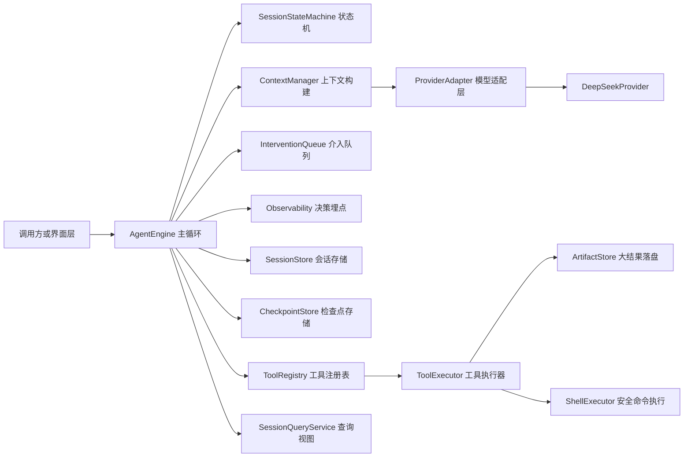
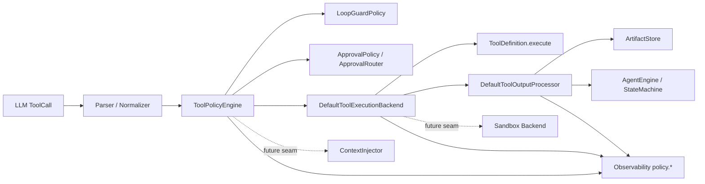
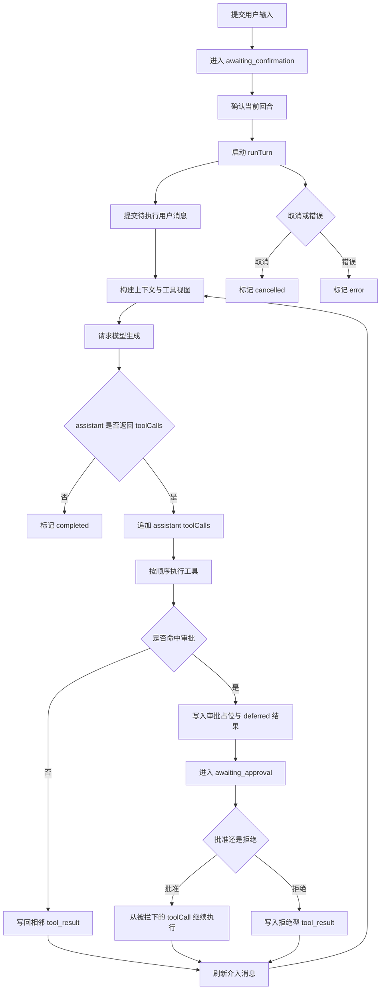

# April Agent Runtime

一个面向 Node 20+ 的通用 TypeScript Agent runtime。它把 ReAct 主循环、LLM 适配层、工具执行、session/checkpoint/artifact 持久化、上下文压缩和决策埋点拆成清晰模块，并把供应商差异限制在 adapter 内。

## 快速开始

```bash
npm install
npm test
npm run build
```

DeepSeek 示例需要设置环境变量：

```bash
export DEEPSEEK_API_KEY=your_api_key
```

本地开发更推荐把密钥放进 `.env.local`，并在启动命令层注入，而不是把读取逻辑塞进 runtime 内部：

```bash
cp .env.example .env.local
```

`.env.local` 示例：

```bash
DEEPSEEK_API_KEY=your_api_key
DEEPSEEK_MODEL=deepseek-chat
DEEPSEEK_TOKENIZER_DIR=/absolute/path/to/deepseek_v3_tokenizer
```

Node 20+ 可以直接在启动命令层加载本地环境文件：

```bash
npm run demo:min -- "Read package.json and summarize this project."
```

如果你想用一条命令验证当前 runtime 的核心闭环，可以直接跑最小 CLI：

```bash
npm run demo:cli -- "Read package.json and summarize this project."
```

这个 CLI 会做四件事：

- 接收一个 prompt（命令行参数没传就进入交互输入）。
- 运行一轮 session。
- 如果命中审批，停在当前进程内，等待你输入 `approve` 或 `deny [reason]`。
- 每一步都打印当前 session 状态和最后一条消息，方便你验证 prompt -> tool -> approval -> resume 这条主链路。

如果你想主动触发审批流，可以给一个明确的写文件 prompt，例如：

```bash
npm run demo:cli -- "Create tmp/cli-demo.txt with hello, then summarize what you changed."
```

上面的脚本会先 build，再通过 `node --env-file=.env.local` 启动 [examples/minimal-run.mjs](examples/minimal-run.mjs)。这样密钥管理停留在命令层，runtime 仍只接收 `process.env` 已经注入好的值。

如果配置了 `DEEPSEEK_TOKENIZER_DIR`，`DeepSeekProvider` 会加载你本地的 `tokenizer.json` 和 `tokenizer_config.json`，把 DeepSeek tokenizer 的估算值写进 `llm.request` / `llm.response` 决策事件；同时 API 返回的真实 `inputTokens` / `outputTokens` 也会一起打印，方便你在验证架构时对照查看。

如果你希望在上下文达到 60%-70% 水位时，先做 receipt compaction，再用一个更便宜的小模型做历史摘要，可以把 `smallModelSummaryConfig` 接到 `createRuntime`：

```ts
import {
  createRuntime,
  DeepSeekProvider,
  smallModelSummaryConfig,
} from './dist/index.js';

const mainProvider = new DeepSeekProvider({
  apiKey: process.env.DEEPSEEK_API_KEY!,
  model: process.env.DEEPSEEK_MODEL ?? 'deepseek-chat',
});

const runtime = createRuntime({
  provider: mainProvider,
  model: process.env.DEEPSEEK_MODEL ?? 'deepseek-chat',
  rootDir: process.cwd(),
  summary: {
    config: {
      ...smallModelSummaryConfig,
      model: 'deepseek-chat',
    },
  },
});
```

`smallModelSummaryConfig` 定义在 `src/runtime/summary-model.config.ts`，可以按你的供应商/成本要求替换成更小的 summary model。

## 运行时架构



## 工具执行策略中间件

当前 runtime 在工具执行链路上新增了一层策略中间件，把“是否允许执行”和“如何执行”拆开：

- Parser / Normalizer 先把 LLM tool call 归一化成稳定输入。
- ToolPolicyEngine 负责 loop guard、审批路由和后续可扩展的风险评分、上下文注入。
- DefaultToolExecutionBackend 负责真正调用工具实现，保留未来替换成系统 shell / 沙箱 backend 的插口。
- DefaultToolOutputProcessor 负责摘要、截断和 artifact offload，不让输出治理散落到各个工具里。



## 执行流程



## 模块职责

- `src/engine`: ReAct 主循环、状态机、上下文构建、介入队列、engine pool、决策事件。
- `src/llm`: 统一 provider 接口和 DeepSeek 适配器。thinking 等供应商专属参数只通过 `extra` 下发。
- `src/runtime`: 统一装配 provider、stores、observability、registry 和内置工具。
- `src/tools`: 工具注册、策略中间件、执行 backend、loop guard、审批拦截、结果压缩、安全 shell 执行。
- `src/tools/builtin`: 内置文件工具、搜索工具和 bash 工具。
- `src/storage`: session、checkpoint、artifact 的抽象与本地实现。
- `src/session`: 对外提供后端权威视图查询，只返回 last messages、isRunning、status 等状态真相。
- `src/types`: 消息协议、运行时契约和 provider/tool 类型。

## 协议保证

- assistant 一旦产出 `toolCalls`，后续 `tool` 消息必须严格相邻。
- 介入消息不会插入到未闭合的 assistant/tool 链中间。
- ToolRegistry 不做 run 级缓存；每轮发 LLM 请求前重新构建可用工具视图。
- loop guard 固定查看最近五次工具调用，并基于 `tool name + stable input hash` 判定重复，命中阈值后直接拦截，不执行工具。
- 写文件工具和高风险 bash 命令会先进入审批态，不直接执行。
- 如果 assistant 一次请求多个工具，而前序工具命中审批，后续工具会写入 deferred tool_result，保持协议闭合。
- 批准后会从被拦截的 toolCall 原地恢复，并继续执行同一批后续工具；拒绝后会写入拒绝型 tool_result，再继续下一轮推理。
- 超大工具输出不会直接回写到上下文，而是落到 artifact store，仅把摘要、元数据和 `artifactId` 回给模型。

## 内置工具

- `read_file`: 读取仓库内文件，支持可选行范围。
- `write_file`: 创建或覆盖文件，默认进入审批流。
- `edit_file`: 精确字符串替换或顺序 replacement patch，默认进入审批流。
- `list_dir`: 目录遍历并返回文件/目录元数据。
- `grep_search`: 仓库内全文/正则检索，返回匹配摘要。
- `bash`: 统一命令与外联入口，所有网络请求都通过这个工具收口；`curl`、`wget`、`ssh`、`scp`、`rm`、`sudo`、全局安装等命令默认进入审批流。

## 输出限制

- `read-file`: 20,000 字符
- `search`: 10,000 字符
- `shell`: 15,000 字符
- `default`: 12,000 字符

## 上下文压缩

- storage 永远保留原始消息历史。
- ContextManager 在发起 provider 请求前生成预算内请求视图。
- 第一层是 micro compaction：当上下文达到软阈值后，先压缩较早且已闭合的 tool result，把正文替换成 compact receipt。
- 第二层是 auto summary：如果 micro compaction 后的 token 估算仍高于软阈值，并且配置了 summary provider，则再调用小模型生成历史摘要。
- summary 只插在安全边界，不切断 assistant `toolCalls` 到 tool result 的邻接关系。

## 状态机

### Formal State Machine Model

The runtime is built around a **deterministic session state machine** that governs the lifecycle of every agent session. The state machine ensures predictable transitions, safe concurrency, and well-defined boundaries for user interaction, tool execution, and error handling.

#### States

```
┌────────────────────────────────────────────────────────────┐
│                    Session State Machine                    │
│                                                            │
│      submitUserInput          confirmTurn                  │
│  ┌──────────┐  ──────────> ┌──────────────┐  ──────────>  │
│  │awaiting_ │              │awaiting_     │               │
│  │  input   │              │confirmation  │               │
│  └──────────┘              └──────────────┘               │
│       ^                          │                         │
│       │                          │  runTurn                │
│       │                          v                         │
│       │                     ┌────────────┐                 │
│       │    turn completes   │  running   │                 │
│       │ ◄─────────────────  │ (ReAct     │                 │
│       │                     │  loop)     │                 │
│       │                     └─────┬──────┘                 │
│       │                           │                        │
│       │             tool hits     │ approval               │
│       │                           v                        │
│       │                     ┌──────────────┐               │
│       │ ◄── approve/deny   │ awaiting_    │               │
│       │                     │  approval    │               │
│       │                     └──────────────┘               │
│       │                           │                        │
│       │              cancel       v                        │
│       │        ┌─────────────┐ ┌──────────┐                │
│       └────────│ completed   │ │ errored  │                │
│                └─────────────┘ └──────────┘                │
└────────────────────────────────────────────────────────────┘
```

| State                 | Meaning                                                              |
|-----------------------|----------------------------------------------------------------------|
| `awaiting_input`      | Session is idle, waiting for new user input.                        |
| `awaiting_confirmation` | User input has been submitted but not yet confirmed for execution. |
| `running`             | The ReAct loop is actively executing a turn (LLM calls + tools).    |
| `awaiting_approval`   | A tool call hit the approval policy; execution paused for decision. |
| `completed`           | The turn finished normally (max steps, assistant completion, cancel).|
| `errored`             | An unrecoverable error occurred during execution.                    |

#### Events & Transitions

| Event                    | Valid Current States            | Next State          | Side Effects                                      |
|--------------------------|---------------------------------|---------------------|---------------------------------------------------|
| `submitUserInput`        | `awaiting_input`                | `awaiting_confirmation` | Stores the user message, increments turn counter. |
| `confirmTurn`            | `awaiting_confirmation`         | `awaiting_confirmation` (confirmed flag set) | Marks the pending input as ready. |
| `runTurn`                | `awaiting_confirmation` (confirmed) | `running`        | Starts the ReAct loop.                            |
| tool hits approval       | `running`                       | `awaiting_approval` | Writes deferred results for subsequent tools in batch; stores pending approval. |
| `approvePendingToolCall` | `awaiting_approval`             | `running`          | Replaces placeholder with actual execution, resumes tool batch. |
| `denyPendingToolCall`    | `awaiting_approval`             | `running`          | Writes denial tool_result, resumes ReAct loop.    |
| `cancel`                 | `running`, `awaiting_approval`  | `completed`        | Interrupts current work, finalizes session.       |
| loop completes           | `running`                       | `completed`        | Assistant returned final answer or max steps hit. |
| unrecoverable error      | `running`                       | `errored`          | Error is recorded; session is non-recoverable.    |

#### Guard Conditions

The state machine enforces the following invariants:

1. **No transition from `awaiting_input` to `running`**: User input must first be submitted and then explicitly confirmed.
2. **No double-spin**: `runTurn` is a no-op if the session is already in `running` or `awaiting_approval`.
3. **Approval is scoped to a toolCall ID**: `approvePendingToolCall` and `denyPendingToolCall` require a specific approval ID; approving one does not auto-approve others in the batch.
4. **Protocol closure**: When a tool batch is interrupted by approval, all subsequent tool calls in that batch receive deferred results to maintain the assistant → tool adjacency invariant.
5. **Cancellation is final**: Once `completed` or `errored`, no further transitions are possible (except a new `submitUserInput` if the runtime supports session reuse).

#### State Machine as the Single Source of Truth

- `SessionStore` persists the current state and its transition history.
- `SessionQueryService` exposes a read-only view (last messages, status, `isRunning`, pending approvals) so UI layers never query the engine directly.
- The `AgentEngine` holds an in-memory reference to the state machine for each active session and delegates all persistence to the store layer.

#### Comparison with xstate / Finite State Machine Patterns

The session state machine is implemented as a lightweight **hand-crafted FSM** rather than pulling in a library like xstate. This keeps the dependency footprint small and makes the transition logic explicit in `AgentEngine.runTurn()` / `processApproval()`. If the state graph grows significantly (e.g., multi-session orchestration, parallel branches, nested states), the architecture supports swapping to a library-based FSM behind the same `SessionStore` interface.

#### Integration with the ReAct Loop

The state machine and the ReAct loop are tightly coupled in `AgentEngine.runTurn()`:

1. **Entry**: Confirm the state is `awaiting_confirmation` → transition to `running`.
2. **Loop**: Build context → call LLM → if tool calls, execute tools → if approval needed, pause → else continue.
3. **Exit**: When the assistant returns a final answer (no tool calls), max steps reached, or cancellation → transition to `completed`.
4. **Error**: Wrap all steps in try/catch → on failure transition to `errored`.

This design ensures that the ReAct loop never "escapes" the state machine — every significant action is a guarded transition.

- `awaiting_input`: 等待新的用户输入。
- `awaiting_confirmation`: 已收到用户输入，但还未开始执行。
- `awaiting_approval`: 某个工具调用因审批要求被暂停，等待外部批准或拒绝。
- `running`: 当前 turn 正在跑 ReAct 循环。
- `completed`: 本轮结束，终止原因可能是 assistant 完成、取消或达到最大步数。
- `errored`: 出现不可恢复错误。

状态动作：

1. `submitUserInput` 把 session 推到 `awaiting_confirmation`。
2. `confirmTurn` 只标记当前待执行输入已确认，不直接跑循环。
3. `runTurn` 只有在输入已确认时才允许进入 `running`。
4. 如果工具命中审批，当前回合会暂停到 `awaiting_approval`，并保留 pending approvals。
5. `approvePendingToolCall` 会移除对应审批项，替换占位结果，并继续执行被阻塞的 tool batch。
6. `denyPendingToolCall` 会写入拒绝型 tool_result，让模型基于拒绝结果继续推理。
7. `cancel` 会尽快中断当前回合，并在同一轮内结束。

## 最小使用示例

直接手工装配：

```ts
import {
  AgentEngine,
  ContextManager,
  DeepSeekProvider,
  MemoryArtifactStore,
  MemoryCheckpointStore,
  MemorySessionStore,
  Observability,
  ToolExecutor,
  ToolRegistry,
} from './dist/index.js';

const provider = new DeepSeekProvider({
  apiKey: process.env.DEEPSEEK_API_KEY!,
  model: 'deepseek-chat',
});

const observability = new Observability();
const registry = new ToolRegistry();
registry.register({
  name: 'echo',
  description: 'Echo input text',
  execute: async (input) => ({ echoed: input }),
});

const engine = new AgentEngine(
  provider,
  registry,
  new ToolExecutor(registry, new MemoryArtifactStore(), observability),
  new MemorySessionStore(),
  new MemoryCheckpointStore(),
  new ContextManager(provider, observability),
  observability,
  {
    model: 'deepseek-chat',
    maxSteps: 8,
    systemPrompt: 'You are a precise coding agent.',
    hardConstraints: ['Keep tool_results adjacent to tool_calls.'],
  },
);

await engine.createSession('demo');
await engine.submitUserInput('demo', 'Use the echo tool then answer.');
await engine.confirmTurn('demo');

const session = await engine.runTurn('demo', {
  extra: {
    thinking: { type: 'enabled' },
  },
});

if (session.status === 'awaiting_approval') {
  const approvalId = session.pendingApprovals[0]?.id;
  if (approvalId) {
    await engine.approvePendingToolCall('demo', approvalId);
  }
}

console.log(session.messages.at(-1));
```

使用内置工具的快捷装配：

```ts
import { createRuntime, DeepSeekProvider } from './dist/index.js';

const runtime = createRuntime({
  provider: new DeepSeekProvider({
    apiKey: process.env.DEEPSEEK_API_KEY!,
    model: 'deepseek-chat',
  }),
  model: 'deepseek-chat',
  rootDir: process.cwd(),
});

await runtime.engine.createSession('demo');
await runtime.engine.submitUserInput('demo', 'Read package.json and summarize it.');
await runtime.engine.confirmTurn('demo');
const session = await runtime.engine.runTurn('demo');

if (session.status === 'awaiting_approval') {
  const approvalId = session.pendingApprovals[0]?.id;
  if (approvalId) {
    const resumed = await runtime.engine.denyPendingToolCall('demo', approvalId, '当前操作不允许。');
    console.log(resumed.messages.at(-1));
  }
}
```

## DeepSeek 说明

- `DeepSeekProvider` 走 OpenAI-compatible `/chat/completions`。
- `extra.thinking` 会映射到 provider 请求体顶层的 `thinking` 字段。
- 通用引擎不感知 DeepSeek 专属字段；它们不会泄漏进 engine 或共享主类型。

## 验证

完整验证命令：

```bash
npm test
npm run typecheck
npm run build
```